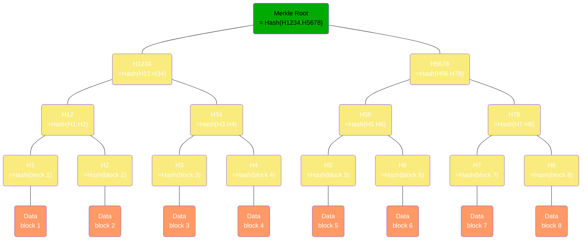
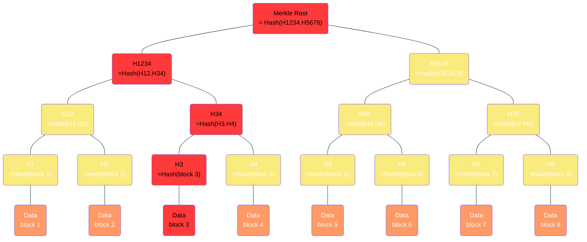
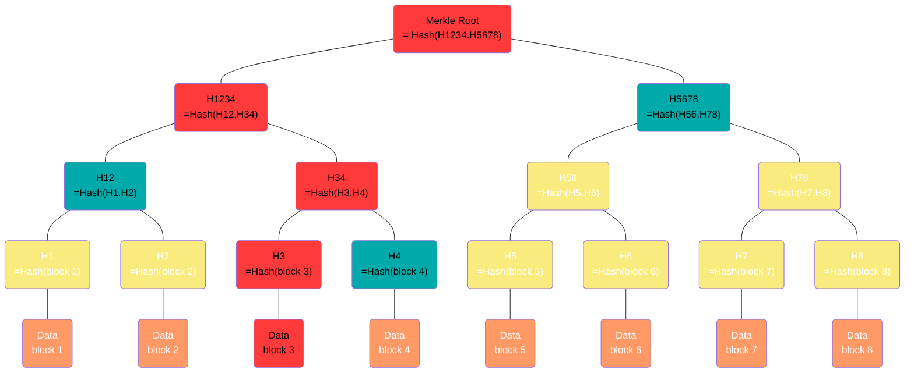

## درخت مرکل چیست

اگر یک فایل حجیم رو دانلود کرده باشید و توی فرایند دانلود مشکلی پیش اومده باشه حتما اهمیت اطمینان از صحت داده‌ها رو حس کردید. راه حل کلاسیک برای اطمینان از صحت داده‌ها گرفتن هش اونا و ارائه‌اش از طریق یک کانال جانبی است(مثلا گذاشتن روی سایت). مثل وقتی که یک فایل iso لینوکس رو دانلود می‌کنید برای اطمینان از اینکه فایل درست دانلود شده هش فایل رو می‌گیرید و با هش‌ای که روی سایت قرار گرفته مقایسه می‌کنید. همیشه هم لازم نیست همه هش رو مقایسه کنید. عموما چون بی‌نظمی هش خیلی بالاست چند رقم اول و آخرش هم برای چک کردن کفایت میکنه (در واقع انتروپی بخشی از هش با انتروپی کلش یکیه). اما خب اینجا چند تا مشکل هست؛

اول اینکه خود هش رو چطور برسونیم دست کاربر؟ گذاشتن هش روی سایت بر اساس اطمینان به سایت هم از نظر مالکش و هم از نظر در دسترس بودنش کار میکنه. خب اگر به مالک اطمینان نداشته باشیم چی؟ اگر سایت از دسترس خارج بشه چی؟ اگر آلوده به بد افزار بشه چی؟

دوم اینکه حالا به فرض که هش رو چک کردیم و فایل درست نبود و بخشیش تخریب شده بود. چه کنیم؟ از اول دانلود کنیم؟ کلی حجمشه! تازه اگر دوباره دانلودش کنم و بازم خراب باشه چی؟ اگر میشد جای خرابی رو شناسایی کرد و فقط همونجا رو دوباره گرفت بهتر بود؛ حجمش کمتره در نتیجه احتمال خرابی مجددش کمتره و حتی اگر خراب باشه هزینه دریافت مجددش زیاد نیست.

مشکل سوم اساسی تره. ما عادت داریم فایل ها رو از یک سرور متمرکز دانلود کنیم. ولی گاهی هم به دلایل فنی (مثلا حجم زیاد یوزر) و هم غیر فنی (مثلا مشکلات کپی رایت) سراغ روش‌های دیگه دسترسی و به اشتراک گذاری فایل‌ها میریم. مثل BitTorrent. حالا تو این سیستم دیگه یه فایل کلش از یه جا دانلود نمیشه، هر قطعه‌اش رو ممکنه از یکی بگیریم و خب هر قطعه ممکنه خراب باشه یا اون کسی که ازش می‌گیریم قابل اعتماد نباشه و قطعه رو آلوده کرده باشه. شاید بگیم خب هش هر قطعه رو میگیریم میزاریم رو سایت و مشکل حل میشه. نه نمیشه، بازم مشکل اول پابرجاست بعلاوه اینکه خب اگر یه فایل 10GB رو 1000 قطعه کنیم و از هش SHA-1 هم برای هش گیری استفاده کنیم سایز هش هر قطعه میشه 40 بایت و در نتیجه سایز لیست هش ها خودش میشه 40MB و خب این خیلی زیاده.

آقای رالف مرکل[^1]، که یکی از مخترعین سیستم رمزنگاری آسیمتریک هم هست، روشی به نام درخت مرکل رو معرفی و بعد هم ثبت اختراع کرد که این مشکلات رو حل میکنه، سال 2002 که حق ثبت اختراعش منقضی شد خیلی از تکنولوژی‌ها مثل BitTorrent و Bitcoin و Git و ... ازش استفاده کردن.

ایده اصلی درخت مرکل اینه که هش قطعات با هم ترکیب بشن و در نهایت یک هش واحد بسازن.


## درخت مرکل چطوری کار میکنه؟
 خیلی ساده اول داده رو به قطعات کوچکتری تقسیم می‌کنیم و هش هر قطعه رو حساب می‌کنیم. بعد دو تا دو تا هش ها رو کنار هم میذاریم و از نتیجه هش می‌گیریم و به عنوان گره بالاتر درخت قرار میدیم؛ اینکارو اونقدر تکرار می‌کنیم تا به یک تک هش برسیم که بهش میگن ریشه مرکل (Merkle Root) و به همین سادگی یک درخت مرکل داریم.


این تیکه کد درخت مرکل یک فایل رو میسازه و هش ریشه رو چاپ میکنه:

```python

import hashlib
import pathlib
import sys
from math import ceil, log2

BLOCK_SIZE = 1*1024*1024 # 1MB
HASH_FUNCTION = hashlib.sha1

p = pathlib.Path(input("Path: "))
if not p.is_file():
    print("Invalid File", file=sys.stderr)
    exit(1)

size = p.stat().st_size
# Fix number of blocks to have a full balanced tree
BLOCK_COUNT = 2**ceil(log2(ceil(size  / BLOCK_SIZE)))
BLOCK_SIZE = ceil(size / BLOCK_COUNT)

print(f"File is {size} bytes - We use {BLOCK_COUNT} blocks of {BLOCK_SIZE} bytes")

class Node:
    def __init__(self, left, right):
        self.left = left
        self.right = right
        if left and right:
            self.name = f"{left.name}-{right.name}"
        else:
            self.name = 'N/A'
        self.digest = HASH_FUNCTION()
        if self.left and self.right:
            self.digest.update(left.digest.digest() + self.digest.digest())

    @staticmethod
    def from_block_data(data: bytes, name=''):
        obj = Node(None, None)
        obj.digest.update(data)
        obj.name = name
        return obj

    def __str__(self):
        return self.digest.hexdigest()

    def __repr__(self):
        return self.digest.digest()

def generate_merkle_tree(p):
    nodes = []

    with p.open('rb') as f:
        chunk_count = 0
        while chunk := f.read(BLOCK_SIZE):
            nodes.append(Node.from_block_data(chunk, str(chunk_count)))
            chunk_count += 1
        if chunk_count % 2:
            nodes.append(Node.from_block_data(b'', str(chunk_count+1)))

    i = 0
    while len(nodes) > 1:
        left = nodes.pop(i)
        right = nodes.pop(i)
        p = Node(left, right)
        nodes.insert(i, p)
        i = (i + 1) % len(nodes)

    root = nodes[0]
    del nodes
    return root


root = generate_merkle_tree(p)
print(f"Merkle Root: {root!s}")

```

## اثبات مرکل و شناسایی قطعه خراب
همونطور که متوجه شدید ریشه مرکل داره از روی هش تمام قطعات ساخته میشه و برای اینکه بفهمیم یک قطعه خرابه یا نه کافیه ریشه مرکل چیزی که دانلود کردیم رو با ریشه مرکل اصلی مقایسه کنیم. ولی خب چه فرقی داره با اینکه از فایل هش بگیریم؟ فرقش اینه که هر گره در درخت مرکل از روی دقیقا دو گره که نماینده نصف دیتا است ساخته میشه پس اگر ریشه درست نبود کافیه یه مرحله در درخت پایین بریم و دو تا هش تشکیل دهنده ریشه رو چک کنیم. به همین سادگی معلوم میشه خرابی در کدوم نیمه دیتاست و همینکارو برای نیمه خراب مجدد تکرار کنیم تا در نهایت برسیم به خود قطعه خراب. اینطوری دقیقا مثل یک جستجوی باینری هر بار مسیر رو تا قطعه خراب نصف میکنیم و در نهایت با مرتبه زمانی $O(log_2(n))$ قطعه خراب پیدا میشه و میشه دوباره دانلودش کرد.
مثلا در تصویر بالا اگر قطعه 3 خراب باشه، اول Merkle Root اشتباه خواهد بود و در نتیجه یا `H1234` و یا `H5678` اشتباه بودن. با مقایسه متوجه میشیم که `H1234` خراب بوده پس یا `H12` و یا `H34` اشتباه بوده و میرسیم به `H34` که نشون میده یا `H3` یا `H4` اشتباهه که چون `H3` اشتباهه مشخص میشه قطعه 3 خرابه و باید دوباره دانلود بشه.


ممکنه بگیم خب اگر هش هر قطعه رو داشته باشیم چه کاریه؟ همونو چک میکنیم دیگه حالا حجم هش ها هرچقدر هم که بود، بود بالاخره از فایل اصلی کوچیکتره

خب اره به شرطی که یک جای قابل اعتماد (Source Of Trust) برای ذخیره این هش‌ها و رسوندنش به کاربر داشته باشیم؛ یه بخشی از این مساله عدم لزوم اعتماد به یک منبع است. ما نمیتونیم بگیم هش هر قطعه تو هدر دانلود قرار بگیره، ممکنه خود بسته خراب شه یا کسی که بسته رو ازش میگیریم اونو آلوده کرده باشه. نمیشه هش‌ها رو هم گذاشت توی یک سرور چون نمیخوایم به سرور وابسته باشیم. میتونیم هش‌ها رو بزاریم توی ساختمان داده‌ای مثل DHT ولی از کجا معلوم که چیزی که دریافت می‌کنیم درسته؟ یه ایده اینه که هش کل هش‌ها رو کنار هم بگیریم و به عنوان امضای فایل به دست کاربر برسونیم و اونم وقتی هش ها رو گرفت میتونه هش کل رو از روش حساب کنه و بفهمه آیا درست اند یا نه. این روش ساده اوکیه ولی مشکلات ما رو حل نمیکنه. اگر یکی از هش‌ها اشتباه بود نمیتونیم بفهمیم کدومش اشتباهه و برای اینکه درستی هر هش رو متوجه بشیم به همه هش‌های درست دیگه هم نیاز داریم.

نکته دیگه هم کاهش زیاد تعداد هش ها برای چک کردن سلامت قطعات است. تو حالتی که برای هر قطعه یک هش ذخیره کنیم وقتی تعداد قطعات زیاد شه تعداد هش‌ها هم به همون اندازه زیاد میشه ولی توی روش مرکل تعداد هش ها به اندازه لگاریتمی از تعداد قطعاته در نتیجه یک فایل 10GB با قطعات 1MB در حالت فلت 10000 هش لازم داره و در حالت مرکل فقط 14 تا هش میخواد و وقتی سایز فایل بشه 20GB فقط یک هش اضافی لازمه، یعنی 15 تا!!

با شیوه درخت مرکل ما میتونیم برای هر قطعه لیستی از هش‌هایی که لازمه تا بشه ریشه مرکل رو محاسبه کرد هم ارسال کنیم و اینطوری اگر ریشه درست در بیاد ما تونستیم اثبات کنیم قطعه‌ای که دانلود شده بخشی از کل دیتا بوده! یعنی هم درست دانلود شده و هم درست و دست نخورده ارسال شده. به این لیست می‌گیم اثبات مرکل (Merkle Proof). مثلا توی مثال بالا علاوه بر قطعه 3 لازمه `H4` و `H12` و `H5678` رو داشته باشیم تا بتونیم ریشه رو حساب کنیم. پس اثبات مرکل میشه: `(H4, H12, H5678)`



از طرفی اگر کل دیتا شامل بیشتر از یک فایل باشه (مثل اشتراک فایل در تورنت) و ما نخوایم همه فایل‌ها رو دانلود کنیم با تکنیک درخت مرکل همچنان میتونیم بخش‌هایی که میخوایم رو اعتبارسنجی کنیم بدون اینکه لازم باشه کل دیتا رو دانلود کنیم. اصطلاحا به این کار میگن Partial Verification. ویژگی Partial Verification اجازه میده به محض اماده بودن قطعات اونا رو بررسی کنیم و لازم نیست منتظر دانلود کل دیتا بمونیم.

در ساختمان داده درخت مرکل فقط لازمه ریشه مرکل از یک منبع معتبر لود بشه و بقیه هش‌ها و اثبات مرکل میتونن از هر منبعی بیان و طبیعتا اگر بعد از محاسبه با ریشه مرکل همخونی نداشته باشن ریجکت میشن.

حتی میشه ریشه مرکل رو به عنوان شناسه داده در نظر گرفت و به این شکل درخواست یک دیتا رو وابسته کرد به داشتن ریشه و در نتیجه ریشه به عنوان امضا همیشه همراه داده خواهد بود.

## کاربردهای درخت مرکل

اساسی‌ترین کاربرد درخت مرکل شناسایی خرابی و اثبات تعلق یک قطعه دیتا به کل یک مجموعه است. و به همین دلیل در سیستم‌هایی که از الگوریتم‌های توزیع شده استفاده میکنن استفاده شده.
- سیستم Git از درخت مرکل برای مدیریت نسخه‌های فایل‌ها بین کامیت‌های مختلف و مشخص کردن اینکه آیا یک فایل متعلق به یک نسخه خاص هست یا نه استفاده میکنه
- سیستم Bittorrent  [^2] و  بقیه پروتکل‌های مشابهش  مثل IPFS و ... از درخت مرکل برای اثبات اصالت قطعات فایل‌های دانلود شده و تصحیح خطا در صورت خرابی یک قطعه استفاده میکنه. همینطوریه که اگر یه فایل رو از جای دیگه دانلود کنید و بندازید توی جای مربوطه‌اش توی تورنت، سیستم تورنت میتونه چک‌اش کنه و بخش‌های صحیحش رو به عنوان دیتا قبول کنه.
- در کریپتوکارنسی‌ها و بلاکچین درخت مرکل اجازه میده بدون اینکه لازم باشه کل یک بلاکچین رو دانلود کنید بررسی کنید که یک تراکنش بخشی از اون بلاکچین هست و معتبره یا نه!
- دیتابیس‌های توزیع شده مثل Cassandra از درخت مرکل برای سینک کردن replica ها استفاده میکنن. به این شکل که هر گره در سیستم توزیع شده دیتابیس یک درخت مرکل میسازه و وقتی عملیات سینک شدن اجرا میشه درخت‌ها با هم مقایسه میشن تا نقاط تفاوت شناسایی بشه (همون مسیر مرکل به قطعه‌ای که با نسخه ما فرق میکنه) و اون قطعه سینک میشه.
- همینطور زنجیره‌های اعتماد مثل CT[^3][^4] با استفاده از درخت مرکل یک سیستم که فقط میتوان به آن اضافه کرد و نمیتوان چیزی را تغییر داد از سرتیفیکت‌ها میسازند. در نتیجه هر نسخه از لاگ‌ها صرفا نسخه‌ای بر نسخه قبلی است.


[^1]: [https://en.wikipedia.org/wiki/Ralph_Merkle](https://en.wikipedia.org/wiki/Ralph_Merkle)
[^2]: [http://bittorrent.org/beps/bep_0030.html](http://bittorrent.org/beps/bep_0030.html)
[^3]: [https://certificate.transparency.dev/](https://certificate.transparency.dev/)
[^4]: [https://datatracker.ietf.org/doc/html/rfc6962](https://datatracker.ietf.org/doc/html/rfc6962)
